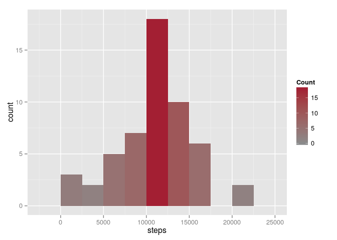
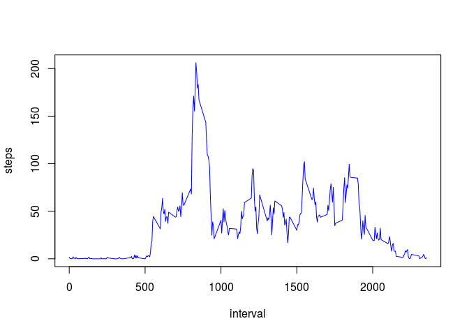
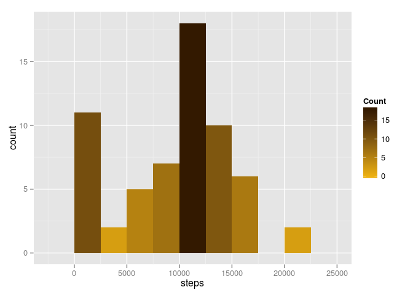
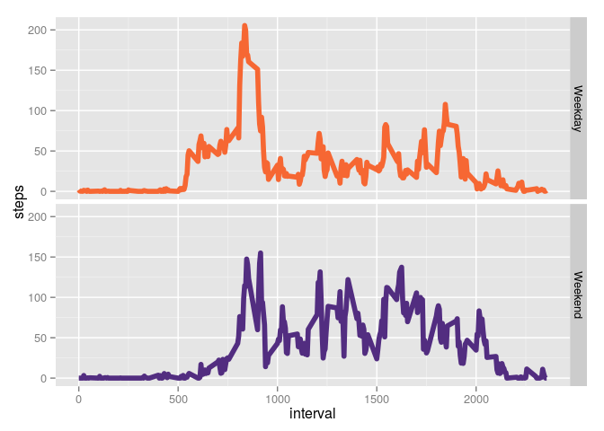

# Reproducible Research: Peer Assessment 1


## Introduction

For this assignment, we will study data from a personal activity monitoring
device, which collects data at 36-second intervals through out the
day. The data consists of two months of data from an anonymous
individual collected during the months of October and November, 2012
and include the number of steps taken in 3 minute intervals (5 collection intervals from the device) each day.

## Loading and preprocessing the data
We begin by loading the [Activity monitoring data](https://d396qusza40orc.cloudfront.net/repdata%2Fdata%2Factivity.zip), as well as the R packages we require for visualization, and setting up some custom colors for the later plots. Note that we assume the .zip file is already in our working directory.


```r
unzip("activity.zip")
activity <- read.csv("activity.csv")
## packages used for some reshaping and plotting of data
require(dplyr)
require(ggplot2)
## colors make your plots nicer
mitred <- "#A31F34"
mitgray <- "#8A8B8C"
wmubrn <- "#331900"
wmugld <- "#EEB111"
cuorng <- "#F66733"
regalia <- "#522D80"
```

The variables included in this dataset are:

* **steps**: Number of steps taking in a 3-minute interval (missing
    values are coded as `NA`)

* **date**: The date on which the measurement was taken in YYYY-MM-DD
    format

* **interval**: Identifier for the 3-minute interval in which
    measurement was taken. Note this is a multiple of 5, as it corresponds to five 36-second (1/100th of a day) intervals from the device.
    
## What is the mean total number of steps taken per day?

We begin by looking into the total number of steps per day. 


```r
steps_per_day <- aggregate(steps ~ date, data = activity, sum)
per_day_plot <- ggplot(x = steps, data = steps_per_day, aes(x = steps, fill = ..count..))
per_day_plot + geom_histogram(binwidth = 2500) + 
    scale_fill_gradient("Count", low = mitgray, high = mitred)
```

 

The plot shows a roughly normal distribution among the total number of steps taken in a day, with a few more "low-activity" days than might be expected, and two days of more than 20,000 steps. Our individual's mean number of steps per day is 10766.19 with median 10765.

## What is the average daily activity pattern?

We now move to activity pattern over the course of a day. The day is broken up into 2400 36-second intervals, and recorded every five intervals (three minutes).


```r
steps_per_interval <- aggregate(steps ~ interval, data = activity, mean)
plot(steps ~ interval, data = steps_per_interval, type = "l", col = "blue")
```

 

The plot shows almost no activity for the first 500-600 intervals, with a large spike in activity occurring around interval 800 and lasting until shortly after interval 900; the peak activity occurs at interval 835 (the mean number of steps taken at this time is 206.17). Activity then fluctuates until around interval 1900, wen it begins to drop down to nearly nothing by the end of the day.

Since every hundredth interval is equivalent to one hour, we might surmise that our individual usually awakens between 5:00 and 6:00 a.m., is most active between 8:00 and 9:00 a.m., and is usually "in for the night" by around 7:00 p.m..

## Imputing missing values
If we look at the actual data set, some intervals have no recorded data (2304 intervals, to be exact). In order to get a more complete picture of our individual's day, we will replace missing values during any given interval with the median number of steps taken for that interval over all days where we have data.


```r
med_steps <- aggregate(steps~interval, data=activity, median)
get_med <- function(elt, ivl) {
    if(is.na(elt)) {
        elt <- {with(med_steps, steps[interval == ivl])}
        }
    return(elt)
    }
activity2 <- activity %>%
    mutate(steps = mapply(get_med, steps, interval))
steps_per_day <- aggregate(steps ~ date, data = activity2, sum)
per_day_plot <- ggplot(x = steps, data = steps_per_day, aes(x = steps, fill = ..count..))
per_day_plot + geom_histogram(binwidth = 2500) +
    scale_fill_gradient("Count", low = wmugld, high = wmubrn)
```

 

Filling in missing data in this way pushes up the number of "low-activity" days (0-2500 steps) without adding to other days. This may be because the median values for most intervals are below, and possibly well below, their mean. Including our imputed values lowers our individual's mean number of steps per day to 9503.87 with median 10395.

## Are there differences in activity patterns between weekdays and weekends?
Finally, we would like to see if our individual has a different activity pattern on weekends than (s)he does during the week.


```r
is.wkday <- function(date) {
    result <- if(weekdays(date) %in% c("Saturday", "Sunday")) "Weekend" else "Weekday"
    return(result)
}
steps_per_interval <- mutate(activity2, wkday = factor(sapply(as.Date(date), is.wkday))) %>%
    group_by(interval, wkday) %>%
    summarize(steps = mean(steps))
g <- ggplot(steps_per_interval, x = interval, y = steps, aes(x = interval, y = steps, color = wkday))
g + geom_line(size = 2) + facet_grid(wkday ~ .) + guides(color = FALSE) + scale_color_manual(values = c(cuorng, regalia))
```

 

Indeed, we see that, while the weekday pattern is quite similar to the overall pattern we saw earlier, the weekend activity shows a somewhat different pattern, where our individual tends to wake up later, and does not do quite so much walking during "commute time", but remains more active in general during daytime, and is active later into the evening than during the week.
